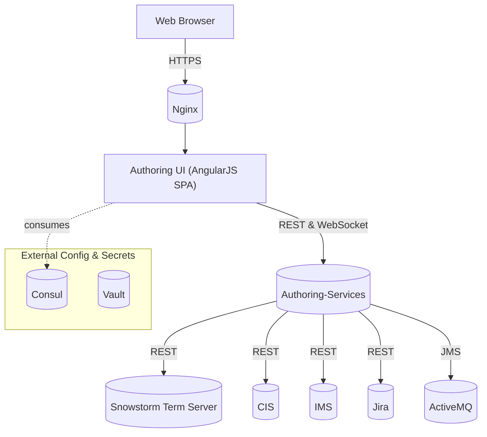
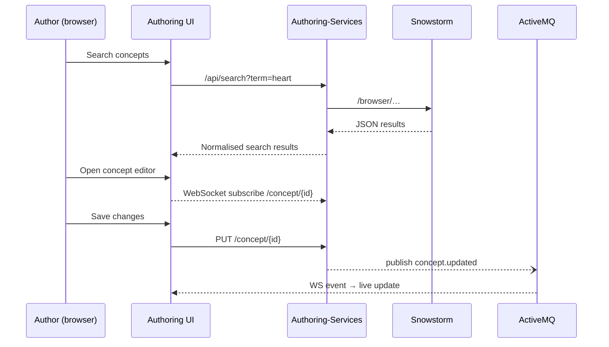

# SNOMED CT Authoring UI

The **Authoring UI** is an AngularJS-based single-page web application that powers the front-end of the SNOMED CT Authoring Platform.  It provides concept search, editing, project management and review workflows for authors and reviewers while integrating with a rich ecosystem of backend services (Authoring Services, Snowstorm, CIS, ActiveMQ, AWS S3, Consul, Vault …).

This document explains **how to run the UI locally** and the **engineering conventions** you should follow when working on the code-base.

---

## 1  High-Level Architecture



<br/>

#### Typical Editing Session



Key points:
* **Stateless front-end** – all state resides in backend services, enabling horizontal scaling.
* **Grunt & NPMher** drive the build pipeline; assets are bundled as a static site.
* **WebSockets (STOMP)** deliver live task/status updates without polling.
* Built artefacts are served via **Nginx** or any static web-server and can be cached aggressively.

---

## 2  Feature Highlights

* **Component Search & Filter** – powerful term + ECL search with language reference-set filters ( @https://github.com/IHTSDO/authoring-ui/blob/master/app/shared/search/search.js ).
* **Concept Editing** – full SNOMED CT concept editor with axioms, descriptions, relationships ( @https://github.com/IHTSDO/authoring-ui/blob/master/app/components/edit/edit.js ).
* **Project & Task Management** – create, merge and review authoring tasks ( @https://github.com/IHTSDO/authoring-ui/blob/master/app/components/project/project.js ).
* **Batch Editing & Template Authoring** – bulk operations and domain templates with validation ( @https://github.com/IHTSDO/authoring-ui/blob/master/app/shared/batch-editing/batchEditing.js ).
* **Classification & Integrity Checks** – client-side dashboards for Snowstorm classification runs ( @https://github.com/IHTSDO/authoring-ui/blob/master/app/shared/classification/classification.js ).
* **Responsive Layout** – Bootstrap 3 and custom SCSS for desktop & tablet workflows.
* **End-to-End Tests with Cypress** ( @https://github.com/IHTSDO/authoring-ui/blob/master/cypress/e2e/test.cy.js ) and unit tests with Karma/Jasmine ( @https://github.com/IHTSDO/authoring-ui/blob/master/test/karma.conf.js ).
* **Structured Logging** via `$log` service wrappers.
* **Consul & Vault support** – runtime config and feature-flags fetched at start-up.

---

## 3  Project Layout

```
app/
  index.html               ← entry-point & ng-view outlet
  app.js                   ← root module & route config
  components/              ← feature modules (edit, project, …)
  shared/                  ← cross-cutting services & directives
  styles/                  ← SCSS source
  images/ fonts/           ← static assets
cypress/                   ← e2e tests
Gruntfile.js               ← build & dev-server tasks
package.json  ← JS dependencies
```

Naming conventions:
* `components/**`     Feature-scoped MV* modules (HTML, JS, SCSS colocated).
* `shared/**`         Reusable services, directives and filters.
* `utilities/**`      Helper scripts consumed across components.

---

## 4  Getting Started Locally

### 4.1  Prerequisites

1. **Node 18+** with **npm** (use [nvm](https://github.com/nvm-sh/nvm)).
2. **Grunt CLI** – `npm install -g grunt-cli`.
3. Backend services reachable on the default local URLs (Authoring-Gateway → `localhost:8080`).

> Hint: A lightweight docker-compose stack for the backend is under discussion – contributions welcome.

### 4.2  Clone & Install

```bash
git clone @https://github.com/IHTSDO/authoring-ui.git
cd authoring-ui
npm install           # installs node & bower dependencies
```

### 4.3  Run in Development Mode

```bash
grunt serve           # opens http://localhost:9000 with LiveReload
```

* Edits to HTML/JS/SCSS trigger automatic reloads.
* API calls are proxied to `localhost:8080` – adjust in `Gruntfile.js` if required.

### 4.4  Build for Production

```bash
grunt build           # outputs minified site to dist/
```

Copy the contents of `dist/` behind any static web-server (Nginx, S3, CloudFront …).

---

## 5  Testing

* **Unit Tests** – `npm test` runs Karma/Jasmine suites located under `app/**/*.spec.js`.
* **End-to-End** – `npx cypress open` launches Cypress with tests in `cypress/e2e/`.


---

## 6  Deployment

1. Run `grunt build` to create the production bundle.
2. Upload the `dist/` folder to your static hosting provider (Nginx root, S3 bucket, Azure Blob …).
3. Configure **cache-busting** headers – files are fingerprinted by `grunt-filerev`.
4. Behind an Nginx ingress add:
   ```nginx
   location / {
       try_files $uri $uri/ /index.html;  # SPA fallback
   }